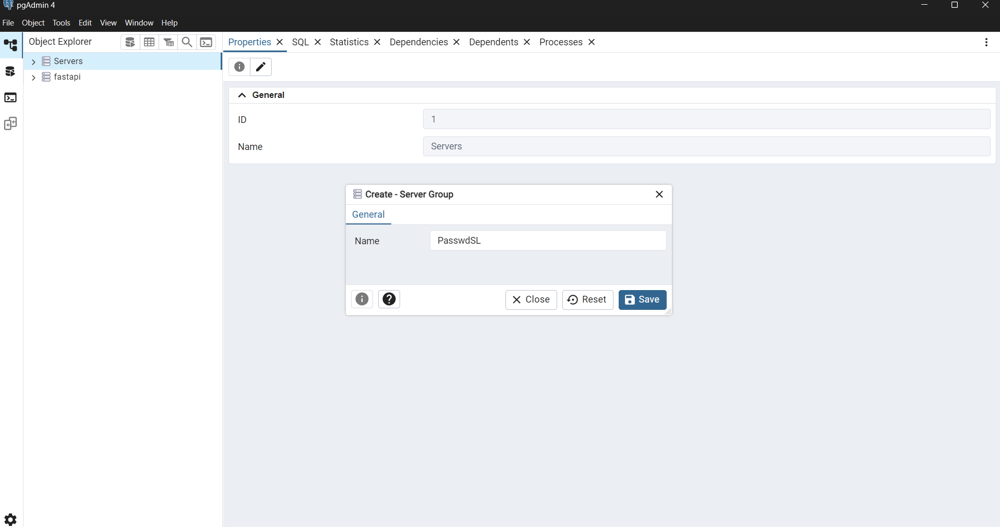
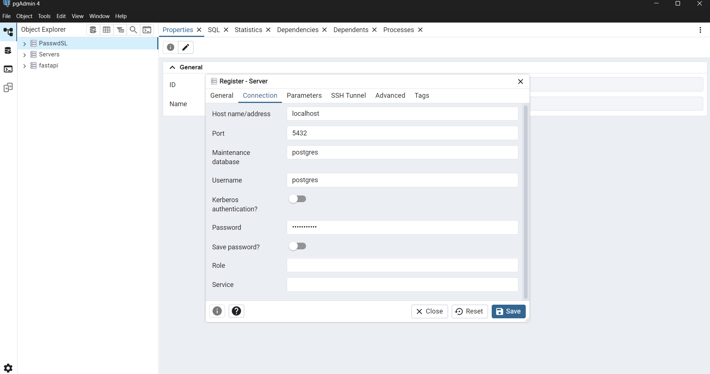
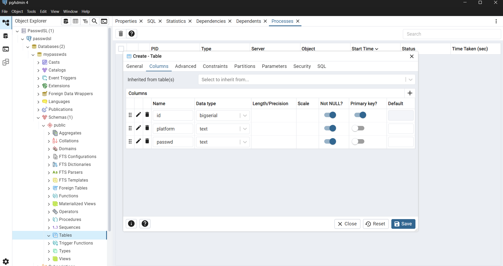

# PasswdSL: Your Personal Command-Line Password Manager

PasswdSL is a console-based password manager that allows you to securely store and manage your credentials in a local PostgreSQL database. It provides a simple and efficient way to handle your passwords directly from the command line.

## Features

- **Secure Local Storage:** All your passwords are stored in a local PostgreSQL database, ensuring that your data remains under your control.
- **Full CRUD Operations:** Create, Read, Update, and Delete your passwords with simple commands.
- **Command-Line Interface:** A straightforward and easy-to-use command-line interface for all operations.
- **Self-Hosted:** No external servers are involved. Your data stays with you.

## Prerequisites

Before you begin, ensure you have the following installed on your system:

- **PostgreSQL:** You must have PostgreSQL installed and running on your system. You can download it from the official PostgreSQL website: [https://www.postgresql.org/download/](https://www.postgresql.org/download/)

## Installation and Setup (Windows)

1.  **Download the Build:** Download the latest version of PasswdSL for **Windows** by clicking [here](https://drive.google.com/uc?export=download&id=1AVYaXIdgnKf5nHXaeZAHtyoJ91gS6qa8).
> **Note:** To use it on Linux and Mac you need to build it from the source code, if you don't know how to do it, then click here to [learn about it](https://hive.blog/python/@makerhacks/how-to-compile-your-python-apps-to-exe-and-maclinux-executables#:~:text=Here%20is%20how%20to%20compile%20your%20Python%20app,additional%20data%20files.%20You%27ll%20need%20Python%203.7%2B%20installed.)
   
2. Unzip the downloaded folder.
3.  **Set Environment Variable:**
    *   Copy the path to the unzipped `passwdsl` folder.
    *   Open the "Environment Variables" settings in Windows.
    *   Under "System variables," select the `Path` variable and click "Edit."
    *   Click "New" and paste the copied path to the `passwdsl` folder.
    *   Click "OK" to save the changes.
4.  **Run PasswdSL:**
    *   Open a new terminal or command prompt.
    *   Type `passwdsl` and press Enter.

## Database Setup

The first time you run a command, PasswdSL will prompt you to set up your database connection.

1.  **Database Name:** When prompted, enter the database name. It is crucial to use `mypasswds` as the database name.
2.  **Table Name:** The table where your passwords will be stored must be named `allpasswds`.
3.  **Table Columns:** The `allpasswds` table must have the following three columns with the exact same names:
    *   `id` (bigserial, PRIMARY KEY)
    *   `platform` (text, NOT NULL)
    *   `passwd` (text, NOT NULL)
4. Restart terminal and type `passwdsl` to start using PasswdSL.

You can use the following SQL script to create the table:

```sql
CREATE TABLE public.allpasswds
(
    id bigserial NOT NULL,
    platform text NOT NULL,
    passwd text NOT NULL,
    PRIMARY KEY (id)
);

ALTER TABLE IF EXISTS public.allpasswds
    OWNER to postgres;

COMMENT ON TABLE public.allpasswds
    IS 'all passwords';
```

### Visual Guide

Here are some images to guide you through the database setup process in PostgreSQL:

**Create Server:**


**Register Server:**


**Create Table:**


## Usage

Once the setup is complete, you can start using PasswdSL with the following commands:

### `passwds`

See all your credentials.
 
```
>_ passwds
```

### `passwd -of 'platform_name'`

See the password for a specific platform.

```
>_ passwd -of gmail
```

### `passadd -cred 'password' -of 'platform_name'`

Add a new password for a platform.

```
>_ passadd -cred MyNewPassword123 -of github
```

### `passrm -of 'platform_name'`

Remove a password for a specific platform.

```
>_ passrm -of facebook
```

### `passup -new 'password' -of 'platform_name'`

Update the password for a specific platform.

```
>_ passup -new MyUpdatedPassword456 -of twitter
```

### `help` or `h`

Display all available commands.

```
>_ help
```

### `q`, `exit`, or `quit`

Exit the PasswdSL console.

```
>_ q 
```

## Contributing

Contributions are welcome! If you have any ideas, suggestions, or bug reports, please open an issue or submit a pull request.

## License

This project is licensed under the MIT License. See the [LICENSE](https://github.com/CoderRony955/PasswdSL/blob/main/LICENSE) file for details.