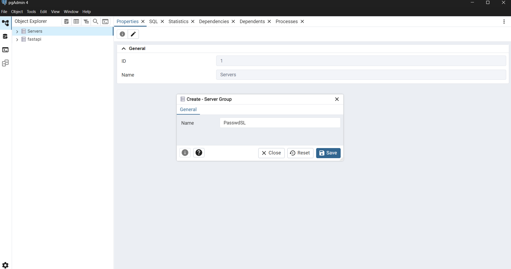
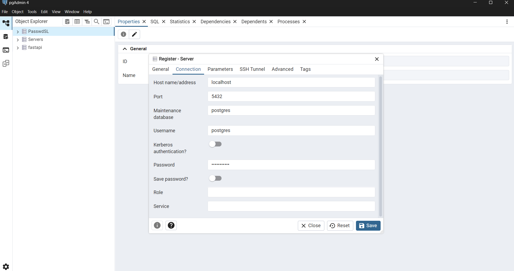
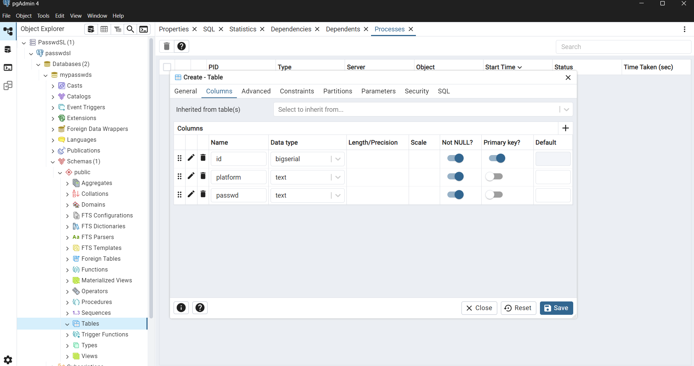

# PasswdSL 🔐

PasswdSL is a local command-line password manager written in Python. It opens an interactive shell where you can add, view, update, and delete credentials stored in your own PostgreSQL database.

It is designed as a personal, self-hosted utility, not a cloud service.

## What This Tool Does

- Stores credentials in PostgreSQL that you control
- Provides a terminal command interface with Rich tables
- Uses a local login password before opening the command shell
- Supports full CRUD workflow for credential records
- Loads database/table/column settings from `config.yaml`

## How It Works

1. `passwdsl.py` starts the app and shows intro text.
2. `onstart/auth.py` handles login password setup and verification.
3. `operations/connection.py` validates database connectivity and can prompt for missing DB config fields.
4. `command_handlers.py` parses commands and calls operation modules.
5. `operations/*.py` runs SQL operations using `db/database.py`.

## Core Features

- Add credential: `passadd`
- List all credentials: `passwds`
- View one credential: `passwd`
- Update credential: `passup`
- Delete credential: `passrm`
- Help command: `help` or `h`
- Exit commands: `q`, `exit`, `quit`

## Tech Stack

- Python `>=3.13`
- PostgreSQL
- `psycopg2`
- `rich`
- `pyyaml`
- `maskpass`

## Project Structure

- `passwdsl.py`: entrypoint and REPL loop
- `command_handlers.py`: command parsing and dispatch
- `config.py`: reads `config.yaml` values into runtime variables
- `operations/`: add/list/view/update/delete and DB connection checks
- `db/database.py`: context-managed psycopg2 connection and cursor
- `onstart/`: intro, help table, auth/login flow
- `sql_queries/`: example SQL scripts
- `example.config.yaml`: starter configuration template

## Security Notes

- Credentials are currently stored in plain text in PostgreSQL.
- App login password (`login_pass`) is stored in plain text in `config.yaml`.
- This project is suitable for local/personal usage and learning, not hardened production security.

## Installation and Setup (All OS)

### 1) Install Python and PostgreSQL

Use the commands below or install manually from official installers.

### Windows

1. Install Python 3.13+ from [python.org](https://www.python.org/) and enable "Add Python to PATH".
2. Install PostgreSQL from [postgresql.org](https://www.postgresql.org/download/windows/).
3. Verify:

```powershell
python --version
psql --version
```

### macOS

Install via Homebrew:

```bash
brew install python@3.13
brew install postgresql
brew services start postgresql
python3 --version
psql --version
```

### Linux (Ubuntu/Debian)

```bash
sudo apt update
sudo apt install -y python3 python3-venv python3-pip postgresql postgresql-contrib
python3 --version
psql --version
```

For Fedora:

```bash
sudo dnf install -y python3 python3-pip postgresql postgresql-server
```

For Arch:

```bash
sudo pacman -S --needed python python-pip postgresql
```

### 2) Clone the Repository

```bash
git clone https://github.com/CoderRony955/PasswdSL.git
cd PasswdSL
```

### 3) Create and Activate a Virtual Environment

### Windows (PowerShell)

```powershell
python -m venv .venv
.venv\Scripts\Activate.ps1
```

### macOS/Linux

```bash
python3 -m venv .venv
source .venv/bin/activate
```

### 4) Install Python Dependencies

Using pip:

```bash
pip install -r requirements.txt
```

Or using uv:

```bash
uv sync
```

### 5) Create `config.yaml`

Copy from template:

### Windows

```powershell
Copy-Item example.config.yaml config.yaml
```

### macOS/Linux

```bash
cp example.config.yaml config.yaml
```

Template:

```yaml
passwdsl:
  database:
    columns:
    - id
    - platform
    - passwd
    dbname: null
    host: null
    password: null
    port: null
    table: null
    user: null
  login_pass: null
```

### 6) Create Database and Table

Expected defaults used in examples:

- Database: `mypasswds`
- Table: `allpasswds`
- Columns: `id`, `platform`, `passwd`

Use `psql`:

```sql
CREATE DATABASE mypasswds;
\c mypasswds

CREATE TABLE public.allpasswds
(
    id bigserial PRIMARY KEY,
    platform text NOT NULL,
    passwd text NOT NULL
);
```

You can also use the provided SQL files:

- `sql_queries/createdb.sql`
- `sql_queries/createtable.sql`

### 7) Run PasswdSL

```bash
python passwdsl.py
```

First startup behavior:

1. If `login_pass` is `null`, app asks you to create a login password.
2. If DB credentials are missing, app prompts and writes them to `config.yaml`.
3. If table is missing and you run `passwds`, app asks for table name and stores it.

## Usage

Command list:

- `help` or `h`
- `passwds`
- `passwd -of <platform>`
- `passadd -cred <password> -of <platform>`
- `passup -new <password> -of <platform>`
- `passrm -of <platform>`
- `q`, `exit`, `quit`

Examples:

```text
>_ passadd -cred MyPass123 -of github
>_ passwds
>_ passwd -of github
>_ passup -new MyNewPass456 -of github
>_ passrm -of github
```

## Troubleshooting

- `config.yaml` missing: copy from `example.config.yaml`.
- DB connection error: verify `dbname`, `host`, `port`, `user`, `password`.
- Reset app login: set `passwdsl.login_pass` to `null`.
- Reset DB prompts: set DB fields under `passwdsl.database` to `null`.
- Table missing errors: create table or set correct table name in `config.yaml`.

## Visual Setup (pgAdmin)





## License

This project is licensed under the [MIT License](https://github.com/CoderRony955/PasswdSL/blob/main/LICENSE). See the LICENSE file for details.

